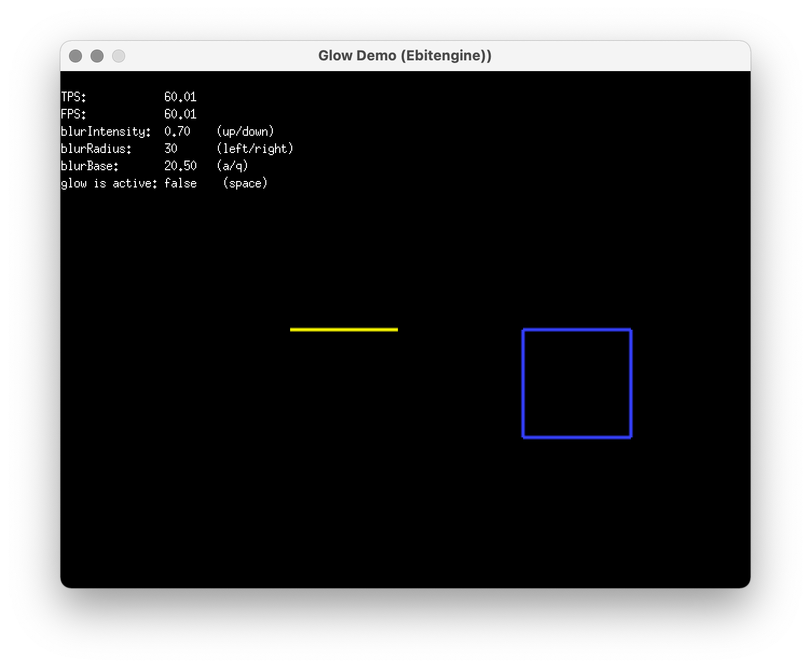
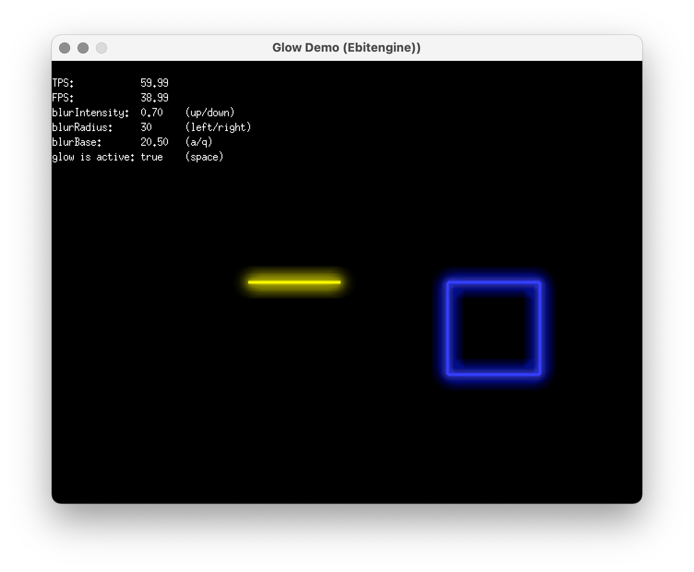

# ebiten-glow

`ebiten-glow` is a Go library built on top of the [Ebiten](https://ebiten.org/) game library. It provides utilities for creating glowing visual effects in 2D games or graphical applications. The library simplifies the process of adding dynamic glow effects to sprites, shapes, and other graphical elements.

## Features

- Easy-to-use API for applying glow effects.
- Customizable glow intensity, and radius.

## Installation

To install the library, use:

```bash
go get github.com/jtbonhomme/ebiten-glow
```

## Example Usage

Below is an example of how to use `ebiten-glow` to apply a glow effect to a simple line:

```go
package main

import (
	"image/color"

	"github.com/hajimehoshi/ebiten/v2"
	"github.com/hajimehoshi/ebiten/v2/vector"
	"github.com/jtbonhomme/ebitenglow"
)

type Game struct{}

func (g *Game) Update() error {
	// ...existing game logic...
	return nil
}

func (g *Game) Draw(screen *ebiten.Image) {
	// Create a line image
	line := ebiten.NewImage(102, 5) // A horizontal yellow line of 100px width
	c := color.RGBA{
		R: uint8(255),
		G: uint8(255),
		B: uint8(50),
		A: uint8(255)}
	vector.StrokeLine(line, 0, 3, 100, 3, 3, c, true)

	// Initantiate a glow effect object with default parameters.
	glowEffect := ebitenglow.New()

	// Draw the glowing line
	glowEffect.DrawImageAt(screen, line, 50, 50)
}

func (g *Game) Layout(outsideWidth, outsideHeight int) (int, int) {
	return 640, 480
}

func main() {
	ebiten.SetWindowSize(640, 480)
	ebiten.SetWindowTitle("Ebiten Glow Line Example")
	if err := ebiten.RunGame(&Game{}); err != nil {
		panic(err)
	}
}
```

## Running the Example Program

An example program demonstrating the usage of `ebiten-glow` is provided in the `example` directory. To run the example:

1. Navigate to the `example` directory:
   ```bash
   cd example
   ```

2. Run the example program:
   ```bash
   go run main.go
   ```

This will launch a window showcasing the glow effect applied to a graphical element.

Here are some screenshots showcasing the glow effects:

* Glow effect **deactivated**


* Glow effect **activated**


*Note*: use `Up`/`Down`, `Left`/`Right`, `A`/`Q` keys to play with parameters.

## License

This project is licensed under the MIT License. See the LICENSE file for details.